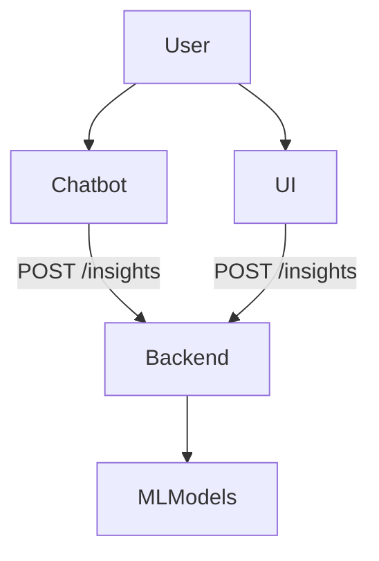

# 📊 Financial Insight API

This project provides a FastAPI backend to generate LLM-based financial insights and forecasts.  
It is designed to work with both a chatbot and a frontend UI for delivering insights to users in real time.

---

## 🔁 API Integration Flow




```markdown
## API Endpoint Specifications

| Endpoint          | Method | Purpose                  |
|------------------|--------|--------------------------|
| `/insights`       | POST   | LLM-based insight        |


## Interactive API Docs

You can test the endpoints and review schemas at:

git:
uvicorn insights:app --reload


- Swagger UI (interactive and user-friendly API documentation): [`/docs`](http://127.0.0.1:8000/docs)
- ReDoc(well-structured, human-readable API specification): [`/redoc`](http://127.0.0.1:8000/redoc)
- OpenAPI Schema (machine-readable API definition in JSON format): [`/openapi.json`](http://127.0.0.1:8000/openapi.json)


```


