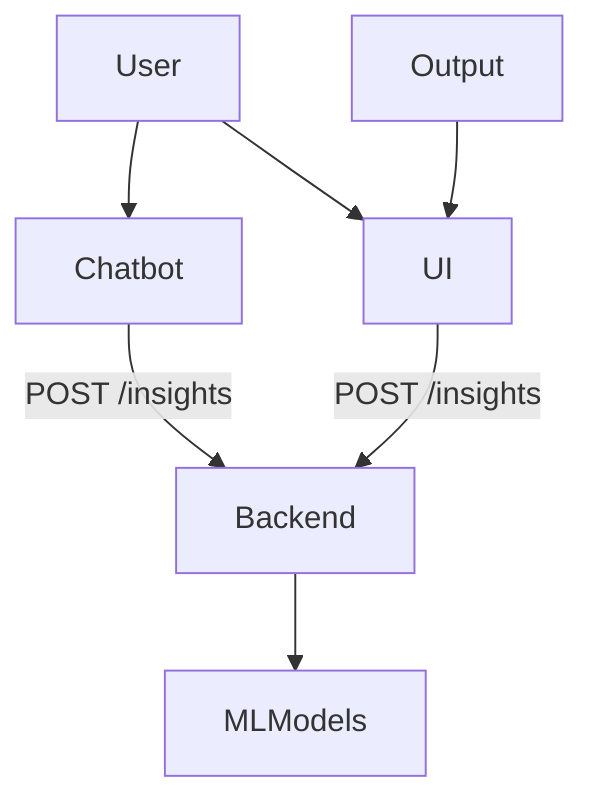

# 📊 Financial Insight API

This project provides a FastAPI backend to generate LLM-based financial insights and forecasts.  
It is designed to work with both a chatbot and a frontend UI for delivering insights to users in real time.

---

## 🔁 API Integration Flow




## API Endpoint Specifications

| Endpoint    | Method | Purpose            |
|-------------|--------|--------------------|
| `/insights` | POST   | LLM-based insight  |

## Interactive API Docs

You can test the endpoints and review schemas locally:


```bash
uvicorn insights:app --reload
```


- **Swagger UI** (interactive and user-friendly): [`/docs`](http://127.0.0.1:8000/docs)  
  ↳ 

- **ReDoc** (well-structured, human-readable): [`/redoc`](http://127.0.0.1:8000/redoc)  
  ↳ 

- **OpenAPI Schema** (machine-readable JSON): [`/openapi.json`](http://127.0.0.1:8000/openapi.json)  
  ↳ [JSON Schema File](docs/openapi.json)


