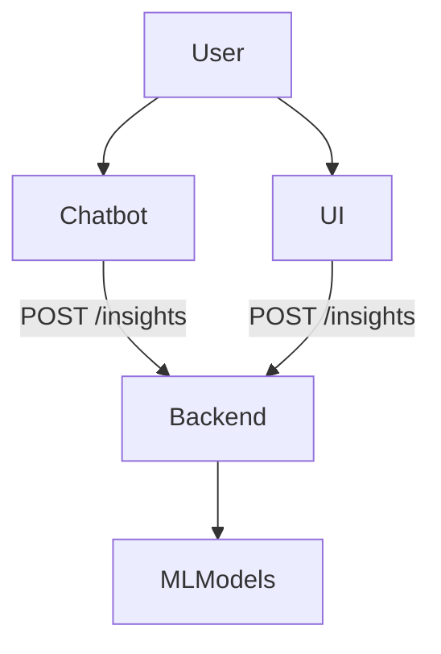
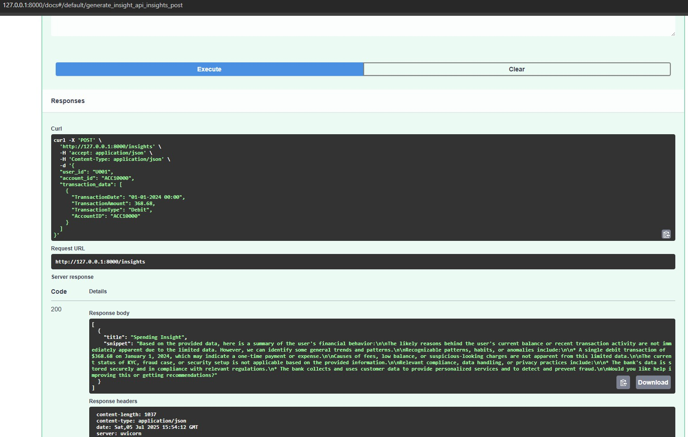
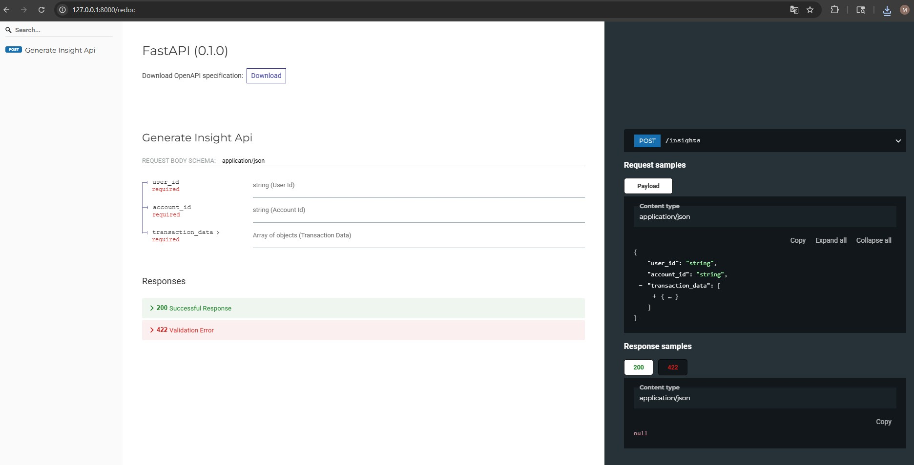

# 📊 Financial Insight API

This project provides a FastAPI backend to generate LLM-based financial insights and forecasts.  
It is designed to work with both a chatbot and a frontend UI for delivering insights to users in real time.

---

## 🔁 API Integration Flow




## API Endpoint Specifications

| Endpoint    | Method | Purpose            | Request Example   | Response Example       |            
|-------------|--------|--------------------|-------------------|------------------------|      
| `/insights` | POST   | LLM-based insight  |{ "query": "..." } | { "insights": "..." }  |      


## Technology Stack  

* **Framework**: FastAPI  

* **Language**: Python 3.10+

* **Libraries**: fastapi, Pydantic, Uvicorn, Facebook Prophet, Groq SDK/API

* **Docs**: Auto-generated with Swagger UI and ReDoc


## 📁 Project Structure

bankease_agentic_app/  
├── backend_api/  
│ ├── insights.py # Entry point of the FastAPI app (defines /insights endpoint)  
│ └── chatbot_logs.jsonl # Output file for chat logs and system actions (generated locally)    
├── logic/    
│ ├── insights_agent2.py # Logic for insight generation using Prophet + LLM  
│ └── prompts.py # Prompt templates for LLM  
└── utils/    
    └── logger.py # JSONL logger for saving insight events  
   


> 💡 Note: `chatbot_logs.jsonl` is not included in the repository. It will be generated when you run the application locally.

## 🔐 Environment Configuration

You must create a `.env` file in the root directory before running the app. This file should contain the following:

```env
GROQ_API_KEY=your_groq_api_key_here
```


## Interactive API Docs

To run the FastAPI server locally:

```bash
uvicorn insights:app --reload
```


- **Swagger UI** (interactive and user-friendly): [`/docs`](http://127.0.0.1:8000/docs)  
  ↳ 

- **ReDoc** (well-structured, human-readable): [`/redoc`](http://127.0.0.1:8000/redoc)  
  ↳ 

- **OpenAPI Schema** (machine-readable JSON): [`/openapi.json`](http://127.0.0.1:8000/openapi.json)  
  ↳ [JSON Schema File](docs/openapi.json)


